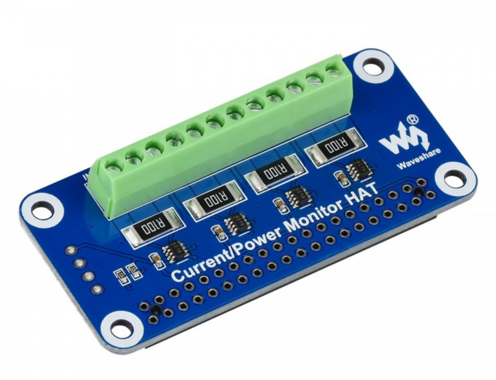

# Measuring battery voltages

The motor controller runs on 48V, so we're using 4 parallell packs of 4x 12V batteries in series. \
For the sake of battery health, I like to keep an eye on the voltage of each battery seperately. \
To accomplish this, we're using 4 of these [voltage hats for raspberry pi](https://www.waveshare.com/current-power-monitor-hat.htm).

These can among other things read 4 voltages. \
Each of them have their own Raspberry Pi Zero W, which have this config:
- Connected to boat WiFi
- SSH enabled
- Password changed
- Hostname like batterypack1, batterypack2, etc
- Docker installed
  - curl -fsSL https://get.docker.com -o get-docker.sh
  - sudo sh get-docker.sh
  - sudo usermod -aG docker pi
- A small Flask webserver running on docker. See [BatteryServer.py](BatteryServer.py).
  - docker build . -t batteryserver
    - Builds the image of the server
  - docker run -d -p 80:5000 -v /dev/gpio/:/dev/gpio/ --restart unless-stopped --name batteryserver batteryserver
    - Starts the container in detached mode
    - Exposes the flask port on port 80 on the host
    - Shares the gpio pins into the container
    - Restarts the container if it should crash
    - Names it batteryserver
  - Home Assistant can now query http://batterypack1.local/1, and get the voltage of the first battery in the first pack.